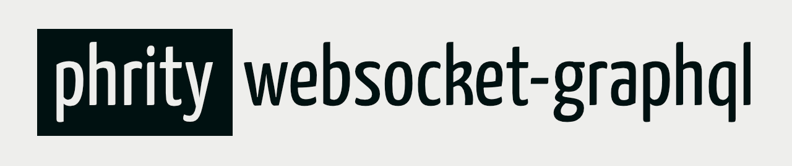

<p align="center"></p>

# Websocket GraphQL Server for PHP

[](https://github.com/sirn-se/phrity-websocket-graphql/actions)
[](https://coveralls.io/github/sirn-se/phrity-websocket-graphql)

This library provides a GraphQL server over WebSocket.

It connects two popular and well developed libraries to achieve a competent and highly configurable server.

- [phrity/websocket](https://packagist.org/packages/phrity/websocket) for WebSocket server
- [webonyx/graphql-php](https://packagist.org/packages/webonyx/graphql-php) for GraphQL API

## Installing

Preferred way to install is with [Composer](https://getcomposer.org/).
```
composer require phrity/websocket-graphql
```

## Setup

You only need to create a GraphQL server config and add it to the middleware provided by this library.

```php
// Setup GraphQL server configuration with schema etc
$serverConfig = GraphQL\Server\ServerConfig::create([
    'schema' => $schema,
]);

// Setup WebSocket server with the GraphQL middleware
$server = new WebSocket\Server($port, $ssl);
$server
    ->addMiddleware(new WebSocket\Middleware\CloseHandler())
    ->addMiddleware(new WebSocket\Middleware\PingResponder())
    ->addMiddleware(new Phrity\WebSocket\GraphQL\Middleware($serverConfig))
    ;

// Run the server - the middleware will respond to requests
$server->start();
```
